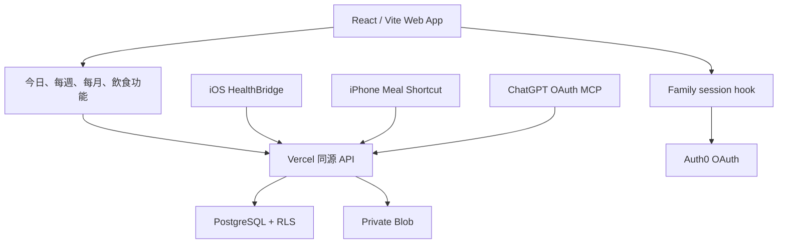

# APP 架構審查與家庭版演進方案

審查日期：2026-08-15

## 結論

現有系統已具備可繼續演進的核心：React 功能模組、同源私人 API、Auth0 session、PostgreSQL RLS、私人圖片儲存、iPhone HealthBridge，以及 ChatGPT 唯讀 MCP。這一輪已先移除最明顯的前端耦合：家庭登入不再由飲食功能管理，Apple Health、飲食及日後功能會共用獨立 `useFamilySession` 身份層。

目前沒有需要推倒重做的結構問題。下一步不應立即把所有家人資料放在一起，而是先加入明確的 household、membership、role 及逐項同意模型，保持「同一家庭平台、每人私人資料」的預設邊界。

## 現有結構



| 層 | 現況 | 審查結果 |
| --- | --- | --- |
| Web UI | `src/features` 分頁、hooks 取資料、lib 純函數 | 基礎良好；身份與飲食已解耦 |
| API | Vercel Functions 路由私人餐食、健康、Auth0、MCP | 安全邊界合理；日後需拆 service／repository |
| 身份 | Auth0 + 加密 HttpOnly session | 瀏覽器不接觸 token，方向正確 |
| 資料 | owner-scoped PostgreSQL RLS | 個人隔離良好；尚未有家庭 membership domain |
| 圖片 | 私人 Blob + 短效受保護縮圖 | 不使用公開 URL，方向正確 |
| iPhone | Shortcut 餐食；HealthBridge 日級健康聚合 | 適合逐步加背景同步，不應上傳原始 HealthKit samples |
| ChatGPT | OAuth MCP 按需唯讀已同步摘要 | 應保持讀取層，不負責排程 HealthKit 同步 |

## 這一輪已改善

1. **獨立家庭 session**：新增 `useFamilySession`，登入、登出、成員身份及 session refresh 不再藏在 `useFoodJournal`。
2. **功能只管理自己的資料**：`useFoodJournal` 現在只負責餐食列表；未登入時保持鎖定、登入後才取私人資料。
3. **澳門時間集中處理**：新增共用時區工具；修正早期 Shortcut 把寫入時間標為 UTC 而造成的顯示偏差。
4. **Shortcut 輸入兼容**：食物及做法可接受清單、逗號、全形逗號、頓號或換行；空白可選欄位不再造成無意義錯誤。
5. **空值介面清楚**：沒有食物或做法標籤時顯示「尚未標示」，不再留下空標題。
6. **頁面按需載入**：今日、週、月及飲食功能分為獨立 browser chunks；只載入目前頁面需要的 UI 和私人資料，控制 iPhone 首次下載量。
7. **多裝置家庭顯示基礎**：新增客廳 iPad 唯讀看板、版本化 `family-board` contract、虛構示範與 fail-closed 設定狀態；手機、iPad、電腦沿用同一身份及資料核心。
8. **摘要與原始資料分流**：家庭看板合約拒絕電郵、體重、餐食、相片及備註等私人欄位，為日後 sharing grant 建立最少披露邊界。

## 主要風險與優先次序

### P1：家庭 membership 尚未成為正式資料模型

目前隔離單位是 `owner_id`，適合一人一個私人空間，但不足以支援邀請、離開家庭、監護／照顧者權限及撤銷共享。

目標模型：

```text
households
  id, name, created_by, created_at

household_memberships
  household_id, user_id, role, status, joined_at

data_sharing_grants
  owner_id, grantee_id, data_scope, permission, expires_at, revoked_at
```

健康、餐食及相片仍保留 `owner_id`。Membership 只證明「屬於同一家庭」，**不代表可以查看彼此健康資料**；跨成員讀取必須有獨立、可撤銷的 sharing grant。

### P1：其餘前後端資料 contract 仍有重複

家庭看板已先採用無秘密、無 Node 依賴的嚴格 Zod contract 與 `schemaVersion`。其餘 response type 及驗證規則仍有部分在瀏覽器 hook 與 server 各自維護，功能增加後可能發生欄位漂移；舊功能應在修改時逐步遷移，不需要一次大搬動。

### P2：server 路由會隨功能增長而過大

維持 Vercel Functions 沒問題，但每個 domain 應逐步分為：

```text
server/domains/<domain>/
  contract.ts      # 輸入輸出規則
  service.ts       # 業務及授權流程
  repository.ts    # PostgreSQL / Blob adapter
  routes.ts        # HTTP 映射，不放核心邏輯
```

不要為了形式一次搬動所有檔案；新功能先採用，舊功能在修改時逐步遷移。

### P2：需要不含健康內容的可觀測性

建議只記錄 request ID、路由、狀態碼、延遲、匿名 owner hash、同步天數及錯誤分類；不得記錄健康數值、餐食文字、圖片、access token 或裝置金鑰。每次 HealthBridge 同步應回傳 receipt ID，讓 iPhone、API、資料庫及 Dashboard 可核對同一次請求。

## 家庭角色與預設權限

| 角色 | 預設可做 | 預設不可做 |
| --- | --- | --- |
| 成員 | 查看自己的資料、管理自己的裝置及金鑰 | 查看其他成員資料 |
| 家庭管理員 | 邀請、停用 membership、查看家庭設定 | 自動查看成員健康或餐食 |
| 獲授權照顧者 | 查看 owner 明確授權的資料範圍 | 寫入、轉授權或查看未授權範圍 |

兒童或需要代理管理的帳戶應另訂 consent／guardian 規則，不能只靠 `isAdmin` 判斷。

## 建議演進順序

1. **已完成**：抽出獨立 family session、修正澳門時間及 Shortcut metadata 邊界。
2. **已完成基礎**：家庭看板 shared contract、schema version、contract tests 及 iPad 響應式骨架；不改現有私人資料內容。
3. **下一個小階段**：加入 households／memberships／sharing grants schema、邀請狀態及跨帳戶負面測試；共享預設關閉。
4. 為 HealthBridge 加可靠的手動同步 receipt、最近同步狀態及可恢復重試，再測背景同步。
5. 先做 opt-in 家庭摘要，再按 data scope 加可撤銷共享；永不以家庭 membership 自動開放全部資料。

## 家庭版可正式邀請的完成條件

- 新成員可獨立登入、登出及撤銷 session。
- 每部 iPhone 有自己的可撤銷裝置憑證。
- A 帳戶無法讀取或修改 B 帳戶資料的負面測試通過。
- Membership 邀請、接受、停用及離開均有 audit event。
- 共享預設關閉；開啟時列明資料種類、對象及撤銷方法。
- Dashboard 顯示資料日期、來源及最近成功同步，而非暗示即時資料。
- ChatGPT scope 與網站權限一致，且不能越過 RLS。

## 不變的產品邊界

- 本平台是健康習慣監督工具，不是醫療診斷系統。
- ChatGPT 只解讀已獲授權、已同步的摘要；不能直接讀 Apple Health，也不負責背景同步。
- HealthBridge 只傳批准的日級聚合，不傳原始 HealthKit samples、裝置序號或來源 App 明細。
- Demo、Preview 及正式私人資料必須清楚分開。
