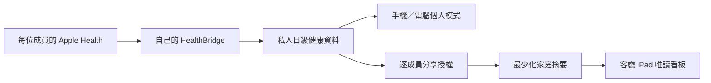

# 家庭多裝置顯示架構

## 目標

同一套家庭健康平台支援三種使用情境，而不是建立三個互不相通的 App：

| 裝置／模式 | 主要用途 | 可顯示內容 | 預設權限 |
| --- | --- | --- | --- |
| 成員手機／個人模式 | 授權 Apple Health、同步、查看自己的詳細趨勢 | 本人的私人健康與餐食資料 | 私人、可操作自己的裝置 |
| 客廳 iPad／家庭看板 | 家人共同查看今日節奏、達標狀態與簡短建議 | 成員明確授權的摘要 | 共用、唯讀、最少披露 |
| 電腦／管理模式 | 邀請成員、管理裝置、分享授權及檢查同步狀態 | 家庭設定及本人資料 | 需登入；管理員不自動取得成員健康資料 |

所有模式共用 Auth0 身份、household membership、PostgreSQL RLS 與版本化資料 contract。裝置只決定介面佈局，不會改變資料權限。

## 兩條資料通道

Membership 只表示某人屬於家庭，不等於可以查看其資料。只有成員主動授權的範圍，才可由後端轉成家庭摘要。撤銷授權後，看板不得再收到該範圍。

## 客廳看板資料合約

前端使用嚴格、版本化的 `family-board` contract，只接受：

- 顯示名稱或自訂簡稱；
- 資料日期與健康分數／評級；
- 步數、運動、睡眠的狀態級別，而非完整原始樣本；
- 本週方向；
- 一項非醫療、可執行建議；
- 已授權的摘要 scope。

合約刻意不包含電郵、體重、體脂、腰圍、照片、餐食細節、備註、owner ID、裝置 ID 或憑證。未知欄位會被拒絕，避免後端日後新增私人欄位時意外顯示在客廳。

目前前端已具備：嚴格 contract、虛構示範、未配置後端時的 fail-closed 狀態、iPad 橫向／直向佈局及只在頁面可見時重新讀取。真正的跨成員摘要仍須下一階段完成 household、membership 及 sharing grant 後端；現階段不會把個人資料自動分享。

## 更新與資料新鮮度

家庭看板會依後端回傳的 `refreshAfterSeconds` 在畫面可見時重新讀取，合約允許 60–900 秒。這只是檢查資料庫是否有較新摘要，不會直接讀取 Apple Health，也不會令 iPhone 自動產生新資料。

實際資料新鮮度仍取決於每位成員的 HealthBridge 最近一次成功同步。看板必須顯示資料日期／最近同步狀態；逾期或缺失時顯示「等待同步」，不可估算或冒充即時數據。

## iPad 固定擺放建議

- 以 Safari 開啟正式網址並「加入主畫面」，使用 standalone 模式。
- 建議橫向放置、連接電源並啟用「引導使用模式」，避免訪客離開看板。
- 使用家庭專用登入 session，不在共用 iPad 開啟個人餐食相片或詳細頁。
- iPad 遺失、搬離家中或家庭成員退出時，應可從電腦撤銷該顯示 session。
- 避免把螢幕放在窗外或訪客可直接看見的位置；即使是摘要亦屬健康相關資訊。

## 下一階段後端完成條件

1. 建立 `households`、`household_memberships`、`data_sharing_grants` 與共用顯示 session。
2. 每位成員可逐項開啟、查看及撤銷分享，預設全部關閉。
3. `/api/private/family-board` 只以後端授權查詢產生最少化摘要。
4. 跨帳戶、已撤銷、已退出家庭及過期 session 的負面測試全部通過。
5. 客廳 iPad 顯示資料日期、最近同步及過期狀態，不暗示即時監測。
6. ChatGPT 仍遵守同一 owner／scope 授權，不因家庭看板開啟而取得更多資料。
