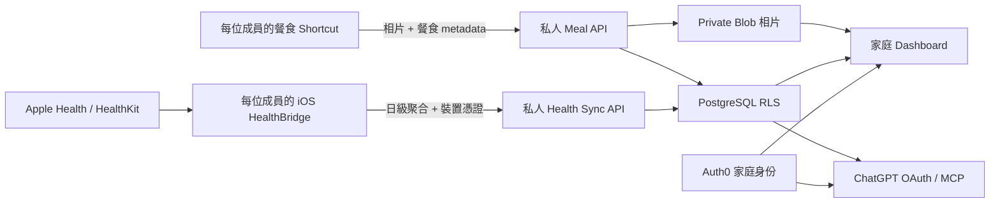

# 家庭健康平台架構

## 一眼理解

核心原則是「共用網站、私人資料空間」。每位家人有自己的 Auth0 身份、owner ID、iPhone 憑證及資料列；PostgreSQL RLS 在資料庫層阻止跨成員讀寫。家庭管理員只管理邀請，不會預設看到其他人的健康或餐食資料。

## 四個資料層

### 1. 公開 Demo

未登入只載入程式內的 14 日虛構 Demo Data。公開頁沒有人工輸入、上傳或真實健康資料。Demo 與私人紀錄不會混合計算。

### 2. 家庭 Dashboard

Auth0 登入後，React 只經同源、`private, no-store` API 讀取該 owner 的餐食與日級健康紀錄。Auth0 token、Shortcut token、同步 token 及 owner ID 不交給瀏覽器 JavaScript。

### 3. iPhone 資料來源

- 餐食：Shortcut 送出已壓縮相片及餐食欄位。
- 健康：原生 iOS HealthBridge 逐類型取得 HealthKit 唯讀授權，在裝置內計算每日聚合後上傳。

Web／ChatGPT 均不能直接讀取 HealthKit。伺服器不收集原始 samples、逐分鐘時間線、sample UUID、裝置序號或來源 App 名稱。

### 4. ChatGPT 解讀層

ChatGPT 經 OAuth MCP 按需呼叫唯讀工具，讀取私人資料庫內已同步的摘要及同步狀態。它不會觸發 HealthKit 同步、不會定時執行，也不會修改健康紀錄。唯讀健康只依賴 PostgreSQL；餐食相片儲存是另一個可獨立啟用的能力。餐食寫入使用 `meal.write`，與 `health.read` 分開。

## 更新頻率

| 部分 | 何時更新 | 現階段承諾 |
| --- | --- | --- |
| Apple Health → 私人資料庫 | 使用者在 HealthBridge 手動同步；其後才加 iOS background delivery | 尚未完成真機閉環，沒有固定頻率 |
| 私人資料庫 → Dashboard | 登入／開頁及畫面重新取得資料時 | 顯示最近一次成功保存的資料 |
| 私人資料庫 → ChatGPT | 每次對話實際呼叫健康工具時 | 按需讀取，不是排程同步 |
| 餐食 Shortcut → Dashboard | Shortcut 成功上傳後，下次取得餐食列表 | 依上傳成功時間 |

iOS 背景工作由系統排程，即使第二階段加入 background delivery，也不能保證每幾分鐘或每日某個準確時間執行。Dashboard 應清楚顯示「最近同步」而非暗示即時資料。

## 狀態用語

- **程式已完成**：程式及自動測試存在，不代表雲端已更新。
- **Preview 已部署**：隔離環境已配置，但不代表真機資料已保存。
- **真機已驗證**：一個全新 iPhone 請求的 API 收據、資料庫 row、Dashboard 與 ChatGPT 同日結果全部一致。
- **正式啟用**：真機驗證後，經使用者確認才 promote 至正式網域。

目前健康後端、私人 Dashboard 顯示及 ChatGPT 唯讀工具屬開發分支能力；尚不可稱為 Apple Health 正式自動同步。

## 家庭擴展閘門

新增家人前，先在 Preview 完成該成員自己的登入、空狀態、獨立 iPhone 憑證及跨帳戶負面測試。Marco 的固定 Connector owner mapping 只供現有資料遷移，不能複製給家人。任何家庭共享檢視都必須逐項同意及另設授權模型。
